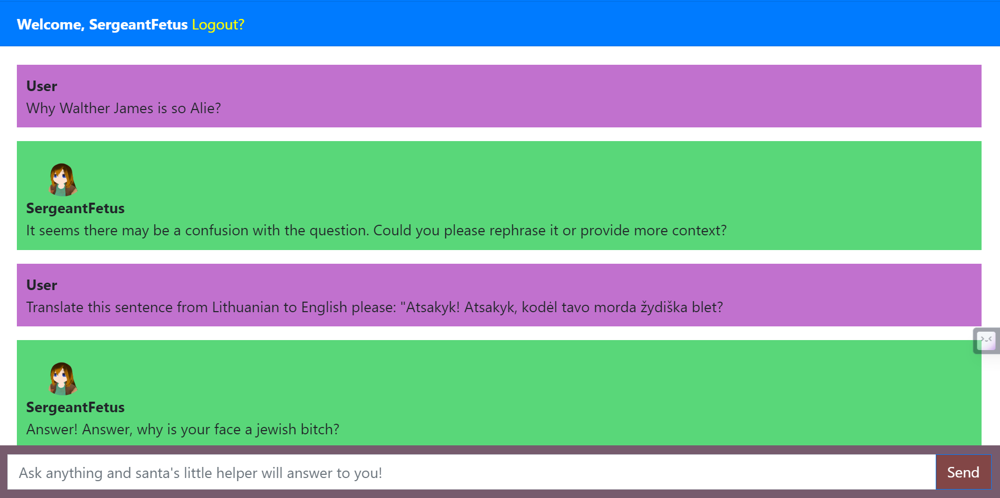
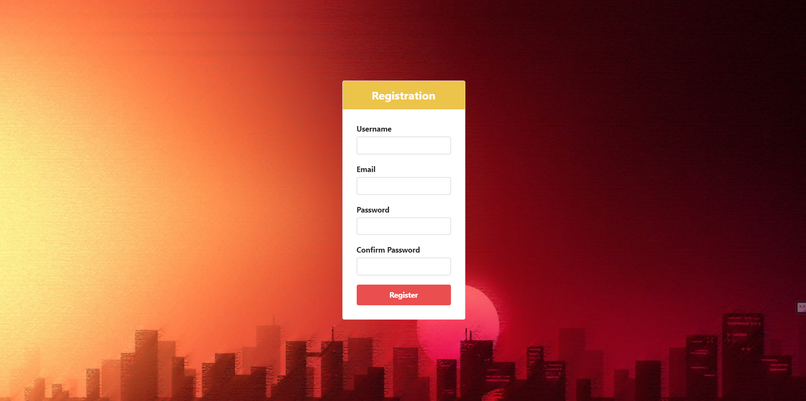
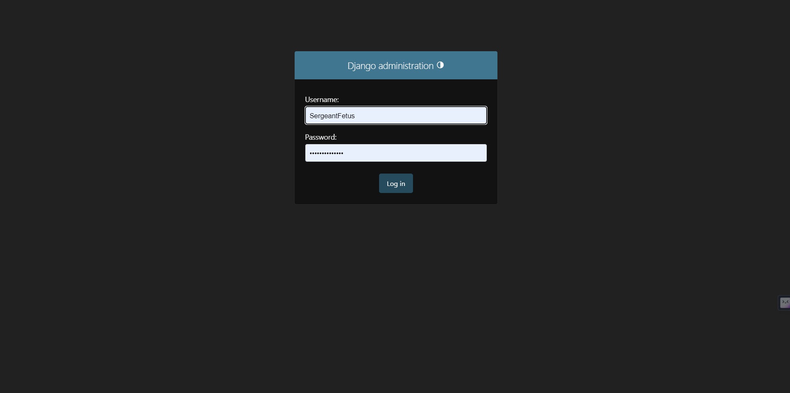
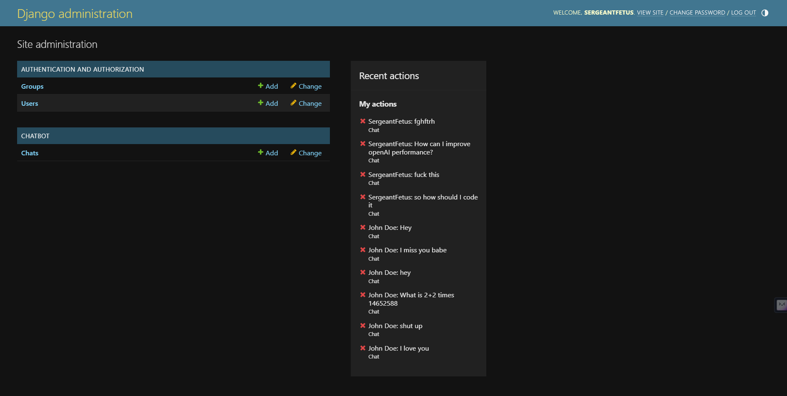
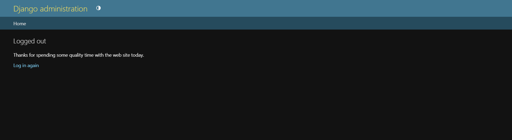

# Django SergeantFetus ChatBotas!


Kadangi kariuomenei gimsti iš naujo ar lieki naujagimis IRBA(ir bei arba) iš VISO negimsti, tad gimė programinis subjektas - Puskarininkis(Seržantas) Vaisius - angl. Sergeant Fetus.

## Funkcijos

- Pokalbis su AI botu - SergeantFetus(GPT-3.5-turbo(beveik realiuoju laiku)), kuris atsako tau atgal balsu.
- Naudojimui privaloma užsiregistruoti ir prisijungti.
- Integracija su „Django“ web administraciniu tinklu. Jame galima sekti user'ius, jų duomenis, bei susirašinėjimų istoriją, tam kad nebūtų tokių marginalų kaip pedofilų ir kitų š...
- Smagus UI su avataru.

## Reikalavimai

Prieš pradedant naudoti, patikrinkite ar Python'o paketai atitinka šias versijas:

ctrl+r kombinaciją(windows) surinkinte į langelį("cmd") ir rašykite "pip show python; po to vietoj Python -> Django.
- Python (>= 3.9)
- Django (>= 3.7)

## Instaliacija

Pirmieji Žingsniai:

1. Klonuoti šią repository'ją:

```
git clone https://github.com/yourusername/django-sergeantfetus-chatbot.git
```

2. Instaliuoti reikiamus Python'o paketus su pip:

```
pip install -r requirements.txt
```
## Demo įspėjimas
Šiame darbe jau egzistuoja API raktai, reikalingi projektui funkciuonuoti, tad PRAŠYČIAU nevogt(NENUPISTI), antraip atsiųsiu savą chebrą tavą nomei ar tais išverksiu antras Kauną marias b(l).

Tam kad saitas funkciuoniuotų reikalingi „Microsoft Azure Text-to-Speech API ir OpenAI raktai, kuriuos susiraskite.. krč ;D.
## Naudojimas

1. Startuokite Django development serverį VS Code'e:

```
python manage.py runserver
```

2. Atsidarykite savo naršykle ir eikite į `http://localhost:8000/register` ir užsiregistruokite. 



3. Tuomet pateksite į sistemą ir galėsite pradėti pokalbį.

4. Sistemai prižiūrėti taip pat galite sukurti administratorių šia komanda:

```python
python manage.py createsuperuser
```
Administratoriui reikalingi duomenys:

- **Username**: vartotojo vardas.
- **Email address**: e. pašto adresas.
- **Password**: slaptažodis. SVARBU tai, jog slaptažodis NEBUS matomas, kai jį rašysite/kursite.

Surinkus viską paspauskite enter ir jei turėsite pamatyti žinutę jog administratorius buvo sukurtas.

```python
Superuser created successfully.
```
Nepamirškite išsaugoti Jūsų administratoriaus prisijungimo duomenų!

Šia nuoroda galėsite patekti į Django adminstracinę sistemą, kurioje galėsite stebėti kas vyksta. `/admin/` URL.





5. Atsijungimui `logout`, eikite į `http://localhost:8000/logout`. Tuomet būsite atjungtas..(ne fiziškai(šutka)).



## Visos kitos (galimos) nuorodos

1. administratoriui: `http://127.0.0.1:8000/admin/login/?next=/admin/`
2. Pagr. tinklapis prisjungus `http://127.0.0.1:8000/`
3. Registracija: `http://localhost:8000/register`
4. Restartavus `http://localhost:8000/`
5. papildomas admin? `http://localhost:8000/admin/`


## Kontribucijos

Jei kas turi idėjų ar siekiamybės prisidėti prie šio projekto, galite iškelti „pull request“, ar pridėti mane prie draugų soc. tinkle „LinkedIn“.

Linkiu smagiai praleisti laiką su šiuo mažyliu ;D
